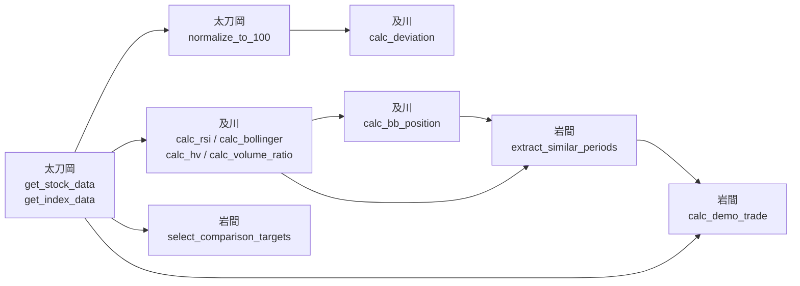

# 開発インターフェース仕様書（確定版）

> 更新履歴：フェーズ0の合意事項に加え、「6. 実装規約」を追記（結合時の事故防止のため、各自のコード生成AIに渡す前提として全員で共有）

## 1. 担当・画面マッピング

| 担当者 | 持つロジック | 持つ画面 |
|---|---|---|
| 太刀岡 | API連携・データ取得、基準日100正規化 | トップ画面 |
| 及川 | テクニカル指標計算（RSI・BB・HV・出来高倍率・乖離率） | 複数指標分析詳細画面 |
| 岩間 | 比較対象自動選出・過去類似局面抽出・デモトレード計算 | 過去類似局面詳細画面・デモトレード結果詳細画面 |
| 山﨑 | （固有ロジックなし） | 株価チャート詳細画面・サマリー画面 |
| 相川 | 例外対応共通モジュール・CSV保存処理 | 補助判断表示画面 |

## 2. 関数インターフェース

### 記法の説明（読む前に）

- `df` … DataFrame（表形式のデータ。Excelの表のようなもの）の略。pandasというライブラリで扱う
- `dict` … キーと値のペアで持つデータ（例：`{market_index: "^N225", peers: ["7203.T", "7267.T"]}`）
- 「入力」列は関数に渡す引数、「出力」列は関数が返す値の中身
- `window=14` のような `=数値` は「デフォルト値」。呼び出すときに指定しなければこの値が使われる
- 「出力（DataFrameカラム）」は、返ってくる表に何という名前の列があるかを示す。例えば `Date, RSI` なら、Date列とRSI列を持つ表が返ってくる

### データフロー図

誰の出力が誰の入力になっているかを図にすると次の通り。矢印の元が「先に完成させる必要がある処理」。



**読み方**：例えば岩間さんの`extract_similar_periods`（類似局面抽出）は、及川さんの`calc_rsi`や`calc_bb_position`の出力（RSI・BB位置の列を持つ表）がないと動かせない。なので開発順は「太刀岡 → 及川 → 岩間」の順に着手するのが自然、という意味がこの図から読み取れる。

### 太刀岡：データ取得・正規化（`logic/data_fetch.py`）

| 関数 | 入力 | 出力（DataFrameカラム） |
|---|---|---|
| `get_stock_data(ticker, period)` | 銘柄コード, 期間 | `Date, Open, High, Low, Close, Volume` |
| `get_index_data(period)` | 期間 | `Date, Close`（日経平均） |
| `normalize_to_100(df, base_date)` | 株価df, 基準日 | `Date, Normalized` |

### 及川：テクニカル指標計算（`logic/indicators.py`）

| 関数 | 入力 | 出力（DataFrameカラム） |
|---|---|---|
| `calc_rsi(df, window=14)` | 株価df | `Date, RSI` |
| `calc_bollinger(df, window=20)` | 株価df | `Date, Upper, Middle, Lower` |
| `calc_bb_position(price_df, bb_df)` | 株価df, BB df | `Date, BBPosition`（`"upper"` / `"mid"` / `"lower"`） |
| `calc_hv(df, window=20)` | 株価df | `Date, HV` |
| `calc_volume_ratio(df, window=20)` | 株価df | `Date, VolumeRatio` |
| `calc_deviation(stock_df, index_df)` | 正規化済み2df | `Date, Deviation` |

### 具体例（イメージをつかむ用）

`calc_rsi`を例にすると、実際のデータの流れはこうなる。

```python
# 入力：太刀岡のget_stock_dataが返す表
#   Date        Open   High   Low    Close   Volume
#   2026-06-01  2500   2550   2480   2530    120000
#   2026-06-02  2530   2560   2510   2545    98000
#   ...

df = get_stock_data("7203.T", "3年")
rsi_df = calc_rsi(df)

# 出力：Date列とRSI列だけを持つ表
#   Date        RSI
#   2026-06-01  NaN   （最初の14日分は計算できないのでNaN=空欄になる）
#   2026-06-15  62.3
#   ...
```

「関数A → 関数B」という依存は、「Aが返す表の列を、Bが入力として受け取る」という意味。表の列名（`Date`や`RSI`など）が食い違うとエラーになるので、この列名がチーム内の共通言語になる。

### 岩間：比較対象選出・類似局面・デモトレード（`logic/comparison.py`, `logic/similar_periods.py`, `logic/demo_trade.py`）

| 関数 | 入力 | 出力 |
|---|---|---|
| `select_comparison_targets(ticker)` | 銘柄コード | `dict {market_index, peers[]}` |
| `extract_similar_periods(current, history, tolerance)` | 現在指標値, 過去指標df, 許容幅 | `Date, RSI, HV, BBPosition, VolumeRatio` |
| `calc_demo_trade(similar_df, price_df, actions, horizons=[5,10,20])` | 類似局面df, 株価df, 投資行動リスト | `Action, Horizon, AvgReturn, WinRate, MaxLoss, MaxDrawdown, AvgHoldDays` |

**類似局面の許容幅（デフォルト・スライダー初期値）**

| 指標 | 許容幅 |
|---|---|
| RSI | ±5 |
| HV | ±3% |
| BB位置 | 同一判定（上限/中央/下限） |
| 出来高倍率 | ±0.3 |

### 相川：例外対応・CSV保存（`logic/error_utils.py`, `logic/csv_export.py`）

| 関数 | 入力 | 出力 |
|---|---|---|
| `show_error(msg)` | メッセージ文字列 | UI表示のみ（返り値なし） |
| `show_warning(msg)` | メッセージ文字列 | UI表示のみ（返り値なし） |
| `save_csv(df, filename)` | df, ファイル名 | `bool`（成功/失敗） |

### 確定事項

- `Date` は文字列（`YYYY-MM-DD`）で統一する
- `BBPosition` は文字列（`"upper"` / `"mid"` / `"lower"`）で表現する
- 類似局面の許容幅は各関数のデフォルト引数として持たせる（`config.py`への切り出しはしない）

## 3. ファイル構成

```
project/
├── app.py                     # エントリポイント（サイドバー等）
├── pages/
│   ├── 1_トップ.py             # 太刀岡
│   ├── 2_サマリー.py           # 山﨑
│   ├── 3_株価チャート.py       # 山﨑
│   ├── 4_複数指標分析.py       # 及川
│   ├── 5_過去類似局面.py       # 岩間
│   ├── 6_デモトレード結果.py   # 岩間
│   └── 7_補助判断.py           # 相川
├── logic/
│   ├── data_fetch.py           # 太刀岡：取得・正規化
│   ├── indicators.py           # 及川：RSI/BB/HV/出来高倍率/乖離率
│   ├── comparison.py           # 岩間：比較対象自動選出
│   ├── similar_periods.py      # 岩間：類似局面抽出
│   ├── demo_trade.py           # 岩間：デモトレード計算
│   ├── error_utils.py          # 相川：st.error/warning共通関数
│   └── csv_export.py           # 相川：CSV保存
└── requirements.txt
```

Streamlitのmulti-page機能は `pages/` フォルダにファイルを置くだけで自動的にサイドバーメニューになる。ファイル名先頭の数字が画面の表示順になる。

## 4. Git運用ルール

### ブランチ命名

```
feature/担当者名-機能名
```

例：`feature/iwama-similar-periods`、`feature/oikawa-indicators`

### Pull Requestルール

- mainブランチへの直接pushは禁止し、必ずPR経由でマージする（GitHubのBranch protection設定を使用）
- マージ前に**必ず1人以上のレビュー承認を必須**にする

### コーディング規約

- 関数名・変数名はスネークケース（`calc_rsi` のように）で統一
- コミットメッセージはprefixなしで自由に書く（内容が分かる一文であればよい）

## 5. 進め方（フェーズ）

| フェーズ | 内容 |
|---|---|
| フェーズ0 | 本ドキュメントの内容（インターフェース・許容幅・ファイル構成）をチーム全員で確定させる |
| フェーズ1 | 太刀岡のデータ取得関数を最優先で完成させる。他メンバーは仮の出力形式を受け取り並行着手 |
| フェーズ2 | 各自がロジック＋自分の画面をブランチで実装し、PRを出す |
| フェーズ3 | サマリー画面（山﨑）・トップ画面（太刀岡）を、他メンバーのPRがマージされた後に仕上げる |

## 6. 実装規約（結合時の事故防止）

インターフェース表だけだと「関数名・カラム名は合っているのに動かない」という事故が起きやすい。以下は各自がコード生成AIに実装を依頼する前に、プロンプトに含めておくべき前提条件。

### 6-1. Dateの持ち方

- `Date`は**DataFrameの列（カラム）として持つ**。`df.index`には設定しない
- 型は文字列（`YYYY-MM-DD`）。`datetime64`型のまま渡さない
- 理由：merge処理（`calc_bb_position`など複数dfを結合する関数）でindex/column不一致による事故が起きやすいため

### 6-2. 異常系の挙動

- データ取得に失敗した場合（銘柄コード不正、通信エラー等）、`get_stock_data` / `get_index_data`は**例外を投げず、空のDataFrame（列だけあって行数0）を返す**
- エラーメッセージの表示（`show_error`）は**呼び出し元の画面側（pages/配下）で行う**。logic/配下の関数はUI処理をしない（Streamlitに依存しない = テストしやすくするため）
- 呼び出し元は「返ってきたdfが空かどうか」を必ずチェックしてから後続処理に渡す

### 6-3. NaNの扱い

- 指標計算関数（`calc_rsi`等）は、計算不能な期間のNaNを**そのまま残して返す**（dropnaしない）
- NaNの除去は、それを使う側（`extract_similar_periods`など）の責任で行う
- 理由：どの関数がdropnaしたか分からなくなると、行数のズレでバグが追いにくくなるため

### 6-4. データ取得ライブラリ

- 株価取得は`yfinance`で統一する（バージョンは`requirements.txt`に固定バージョンを明記）
- 日経平均は`^N225`のティッカーで取得する

### 6-5. st.session_stateのkey命名

- 画面間でデータを受け渡す場合のkeyは `担当領域_変数名` のスネークケースで統一する
  例：`stock_price_df`、`selected_ticker`、`similar_periods_df`
- 各自が使うkey名は実装前にPRの説明欄かSlack等で一言共有してから使う（無断で新規key追加しない）

### 6-6. キャッシュ

- データ取得系（`get_stock_data` / `get_index_data`）には`@st.cache_data`を付与する（引数：`ttl=3600`）
- 計算系（indicators.py配下等）はキャッシュ付与を任意とする（重い処理のみ個別判断）

### 6-7. 型ヒント・docstring

- 関数には型ヒントを付ける（例：`def calc_rsi(df: pd.DataFrame, window: int = 14) -> pd.DataFrame:`）
- docstringは1行でよいので、入力・出力の概要を書く（本仕様書のコピペで可）
